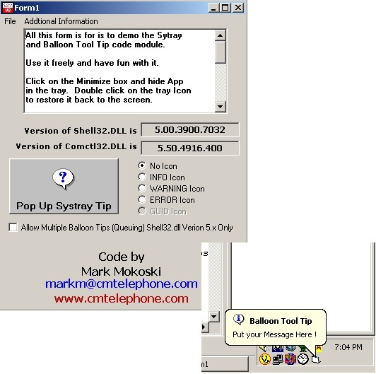



## SysTray and Balloon Tip Code Module UPDATE

### Description

This is an update for a previous PSC project. A question came up on VBforums.com about some behavior differences between Win2K and WinXP as to the tray balloon tip. See code and included links for differences between Shell32.dll ver5.x (Win2k) and Shell.dll ver 6.x (WinXP). Comments welcome, votes not nessesary.

Original VBforums.com message thread is ...

http://www.vbforums.com/showthread.php?p=2003189#post2003189
 
### More Info
 

             |
---                |---
**Submitted On**   |2005-05-05 16:11:34
**By**             |[Mark Mokoski](https://github.com/Planet-Source-Code/PSCIndex/blob/master/ByAuthor/mark-mokoski.md)
**Level**          |Intermediate
**User Rating**    |5.0 (20 globes from 4 users)
**Compatibility**  |VB 6\.0
**Category**       |[Windows API Call/ Explanation](https://github.com/Planet-Source-Code/PSCIndex/blob/master/ByCategory/windows-api-call-explanation__1-39.md)
**World**          |[Visual Basic](https://github.com/Planet-Source-Code/PSCIndex/blob/master/ByWorld/visual-basic.md)
**Archive File**   |[SysTray\_an188490552005\.zip](https://github.com/Planet-Source-Code/mark-mokoski-systray-and-balloon-tip-code-module-update__1-60374/archive/master.zip)

